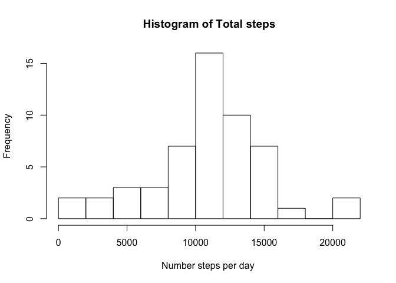
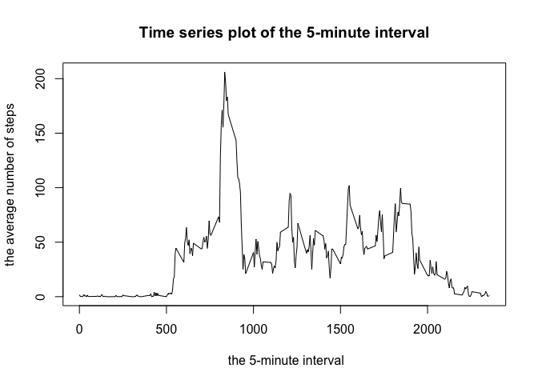
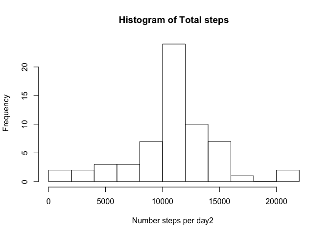

# Reproducible Research: Peer Assessment 1
## Pre-Condition
- Fork/clone the GitHub repository created(http://github.com/rdpeng/RepData_PeerAssessment1) for this assignment
- Already set working directory into cloned GitHub repo

## Loading and preprocessing the data
1. Load the data (i.e. read.csv())  

```r
unzip("activity.zip")
df <- read.csv("activity.csv")
dim(df)
```

```
## [1] 17568     3
```

```r
names(df)
```

```
## [1] "steps"    "date"     "interval"
```

```r
str(df)
```

```
## 'data.frame':	17568 obs. of  3 variables:
##  $ steps   : int  NA NA NA NA NA NA NA NA NA NA ...
##  $ date    : Factor w/ 61 levels "2012-10-01","2012-10-02",..: 1 1 1 1 1 1 1 1 1 1 ...
##  $ interval: int  0 5 10 15 20 25 30 35 40 45 ...
```

```r
head(df,10)
```

```
##    steps       date interval
## 1     NA 2012-10-01        0
## 2     NA 2012-10-01        5
## 3     NA 2012-10-01       10
## 4     NA 2012-10-01       15
## 5     NA 2012-10-01       20
## 6     NA 2012-10-01       25
## 7     NA 2012-10-01       30
## 8     NA 2012-10-01       35
## 9     NA 2012-10-01       40
## 10    NA 2012-10-01       45
```

2. Process/transform the data (if necessary) into a format suitable for your analysis  
Create the subset without NA value 

```r
df_NO_NA<-df[complete.cases(df),]
dim(df_NO_NA)
```

```
## [1] 15264     3
```

```r
names(df_NO_NA)
```

```
## [1] "steps"    "date"     "interval"
```

```r
str(df_NO_NA)
```

```
## 'data.frame':	15264 obs. of  3 variables:
##  $ steps   : int  0 0 0 0 0 0 0 0 0 0 ...
##  $ date    : Factor w/ 61 levels "2012-10-01","2012-10-02",..: 2 2 2 2 2 2 2 2 2 2 ...
##  $ interval: int  0 5 10 15 20 25 30 35 40 45 ...
```

```r
head(df_NO_NA,10)
```

```
##     steps       date interval
## 289     0 2012-10-02        0
## 290     0 2012-10-02        5
## 291     0 2012-10-02       10
## 292     0 2012-10-02       15
## 293     0 2012-10-02       20
## 294     0 2012-10-02       25
## 295     0 2012-10-02       30
## 296     0 2012-10-02       35
## 297     0 2012-10-02       40
## 298     0 2012-10-02       45
```

## What is mean total number of steps taken per day?
1. Calculate the total number of steps taken per day  

```r
total_steps <- aggregate(steps ~ date, df_NO_NA,sum)

head(total_steps,5)
```

```
##         date steps
## 1 2012-10-02   126
## 2 2012-10-03 11352
## 3 2012-10-04 12116
## 4 2012-10-05 13294
## 5 2012-10-06 15420
```

2. If you do not understand the difference between a histogram and a barplot, research the difference between them. Make a histogram of the total number of steps taken each day  

```r
hist(
    total_steps$steps,
    main="Histogram of Total steps",
    xlab = "Number steps per day ",
    breaks = 15
)
```

<!-- -->

3. Calculate and report the mean and median of the total number of steps taken per day  

```r
mean(total_steps$steps)
```

```
## [1] 10766.19
```

```r
median(total_steps$steps)
```

```
## [1] 10765
```

## What is the average daily activity pattern?
1. Make a time series plot (i.e. 𝚝𝚢𝚙𝚎 = "𝚕") of the 5-minute interval (x-axis) and the average number of steps taken, averaged across all days (y-axis)  

```r
interval_time_series <- aggregate(steps ~ interval, df_NO_NA,mean)
head(interval_time_series,5)
```

```
##   interval     steps
## 1        0 1.7169811
## 2        5 0.3396226
## 3       10 0.1320755
## 4       15 0.1509434
## 5       20 0.0754717
```

```r
plot(
    interval_time_series$interval,
    interval_time_series$steps, 
    type = "l",
    main = "Time series plot of the 5-minute interval",
    xlab = " the 5-minute interval",
    ylab = " the average number of steps "
    )
```

<!-- -->

2. Which 5-minute interval, on average across all the days in the dataset, contains the maximum number of steps?  

```r
interval_time_series[interval_time_series$steps == max(interval_time_series$steps),]
```

```
##     interval    steps
## 104      835 206.1698
```

## Imputing missing values
1. Calculate and report the total number of missing values in the dataset (i.e. the total number of rows with 𝙽𝙰s)  

```r
sum(is.na(df$steps))
```

```
## [1] 2304
```

2. Devise a strategy for filling in all of the missing values in the dataset. The strategy does not need to be sophisticated. For example, you could use the mean/median for that day, or the mean for that 5-minute interval, etc.  

```r
df_NA <- !complete.cases(df)
df2 <- df[df_NA == TRUE,]
#print some value of df2
#head(df2,10)
df2[,1] <- interval_time_series$steps
#head(df2,10)
# return 0 , it means no NA values exist in df2
sum(is.na(df2$steps))
```

```
## [1] 0
```

3. Create a new dataset that is equal to the original dataset but with the missing data filled in.  

```r
df_fill_NA <- rbind(df_NO_NA,df2)
```

4. Make a histogram of the total number of steps taken each day and Calculate and report the mean and median total number of steps taken per day. Do these values differ from the estimates from the first part of the assignment? What is the impact of imputing missing data on the estimates of the total daily number of steps?  

```r
steps_per_days2 <- aggregate(steps ~ date, data=df_fill_NA,sum)
hist(steps_per_days2$steps,
    main="Histogram of Total steps",
    xlab = "Number steps per day2 ",
    breaks = 15)
```

<!-- -->

```r
summary(steps_per_days2$steps)
```

```
##    Min. 1st Qu.  Median    Mean 3rd Qu.    Max. 
##      41    9819   10770   10770   12810   21190
```

```r
mean(steps_per_days2$steps)
```

```
## [1] 10766.19
```

```r
median(steps_per_days2$steps)
```

```
## [1] 10766.19
```

#### Do these values differ from the estimates from the first part of the assignment?
Those values differ, but just small.
- mean value has same value 
- median has a bit of difference (10765 | 10766.19 )

#### What is the impact of imputing missing data on the estimates of the total daily number of steps?
This seems to highly depend on how you impute the missing data. Since I used the mean for a given interval, there was practically no difference because we basically pulled the averages closer to the inserted average value.

## Are there differences in activity patterns between weekdays and weekends?
For this part the 𝚠𝚎𝚎𝚔𝚍𝚊𝚢𝚜() function may be of some help here. Use the dataset with the filled-in missing values for this part.  

1. Create a new factor variable in the dataset with two levels – “weekday” and “weekend” indicating whether a given date is a weekday or weekend day.  

```r
new_df <- df_fill_NA
weekend <- weekdays(as.Date(new_df$date)) %in% c("Saturday", "Sunday")
new_df$daytype <- "weekday"
new_df$daytype[weekend == TRUE] <- "weekend"
## convert to factor
new_df$daytype <- as.factor(new_df$daytype)
#check the result
str(new_df)
```

```
## 'data.frame':	17568 obs. of  4 variables:
##  $ steps   : num  0 0 0 0 0 0 0 0 0 0 ...
##  $ date    : Factor w/ 61 levels "2012-10-01","2012-10-02",..: 2 2 2 2 2 2 2 2 2 2 ...
##  $ interval: int  0 5 10 15 20 25 30 35 40 45 ...
##  $ daytype : Factor w/ 2 levels "weekday","weekend": 1 1 1 1 1 1 1 1 1 1 ...
```

```r
head(new_df, 5)
```

```
##     steps       date interval daytype
## 289     0 2012-10-02        0 weekday
## 290     0 2012-10-02        5 weekday
## 291     0 2012-10-02       10 weekday
## 292     0 2012-10-02       15 weekday
## 293     0 2012-10-02       20 weekday
```

```r
weekdays(as.Date(new_df$date[3]))
```

```
## [1] "Tuesday"
```

2. Make a panel plot containing a time series plot (i.e. 𝚝𝚢𝚙𝚎 = "𝚕") of the 5-minute interval (x-axis) and the average number of steps taken, averaged across all weekday days or weekend days (y-axis). See the README file in the GitHub repository to see an example of what this plot should look like using simulated data.  

```r
## plot time series
newinterval <- aggregate(steps ~ interval + daytype, new_df, mean)
library(lattice)
xyplot(
        steps ~ interval | daytype,
        newinterval,
        type = "l",
        layout = c(1,2),
        xlab = "Interval",
        ylab = "Number of steps"
)
```

<!-- -->
